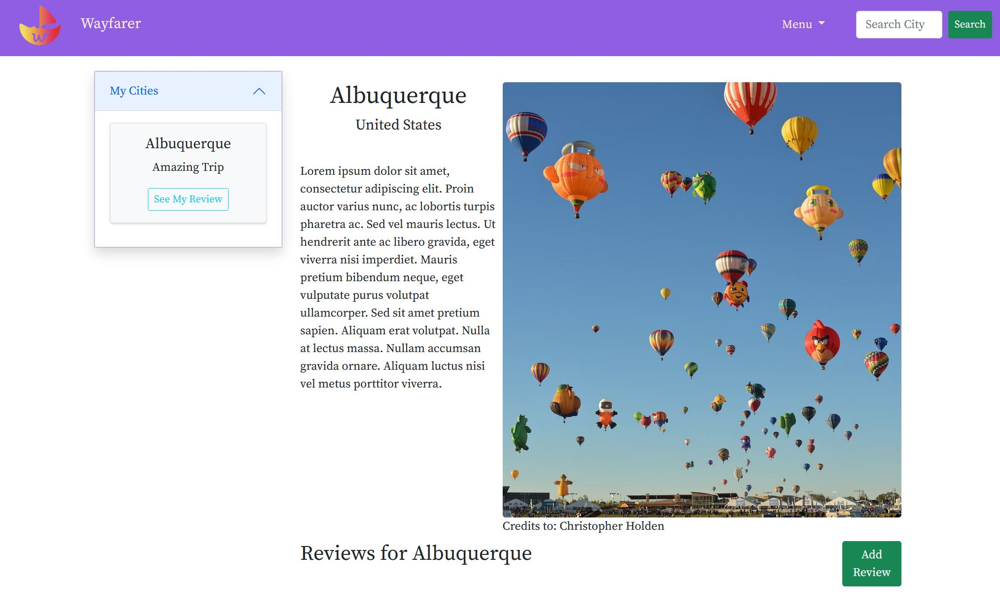

<!DOCTYPE html>
<html>
  <head>
    <meta charset="utf-8">
    <meta http-equiv="X-UA-Compatible" content="IE=edge">
    <title>Devin Brunk</title>
    <meta name="description" content="">
    <meta name="viewport" content="width=device-width, initial-scale=1">
    <meta name="robots" content="all,follow">
    <!-- Bootstrap CSS-->
    <link rel="stylesheet" href="vendor/bootstrap/css/bootstrap.min.css">
    <!-- Google fonts-->
    <link href="https://fonts.googleapis.com/css?family=Roboto+Condensed:300,700" rel="stylesheet">
    <link href="https://fonts.googleapis.com/css?family=Open+Sans:300,400,700" rel="stylesheet">
    <!-- Lightbox-->
    <link rel="stylesheet" href="vendor/lightbox2/css/lightbox.min.css">
    <!-- theme stylesheet-->
    <link rel="stylesheet" href="css/style.default.css" id="theme-stylesheet">
    <!-- Custom stylesheet - for your changes-->
    <link rel="stylesheet" href="css/custom.css">
    <!-- Leaflet CSS - For the map-->
    <link rel="stylesheet" href="https://cdnjs.cloudflare.com/ajax/libs/leaflet/1.4.0/leaflet.css">
    <!-- Favicon-->
    <link rel="shortcut icon" href="favicon.png">
    <!-- Tweaks for older IEs--><!--[if lt IE 9]>
        
        <![endif]-->
  </head>
  <body>
    <!-- Hero Section-->
    <section id="intro" style="background: url(img/startup-room.jpg)" class="hero bg-cover">
      

      

        

          
Welcome to my digital home

          <h1 class="text-uppercase hero-text text-white">Devin Brunk</h1>
          
 

        

      
<a href="#about" class="scroll-btn link-scroll"><i class="fas fa-angle-double-down"></i></a>
    </section>
    <!-- Navbar-->
    <!-- navbar-->
    <header class="header sticky-top">
      <nav class="navbar navbar-expand-lg bg-white border-bottom py-0">
        

          <button type="button" data-toggle="collapse" data-target="#navbarSupportedContent" aria-controls="navbarSupportedContent" aria-expanded="false" aria-label="Toggle navigation" class="navbar-toggler navbar-toggler-right"></button>
          

            <ul class="navbar-nav ml-auto px-3">
              <li class="nav-item active"><a href="#intro" class="nav-link text-uppercase link-scroll">Home </a></li>
              <li class="nav-item"><a href="#about" class="nav-link text-uppercase link-scroll">About</a></li>

              <li class="nav-item"><a href="#portfolio" class="nav-link text-uppercase link-scroll">Portfolio</a></li>

              <li class="nav-item"><a href="#contact" class="nav-link text-uppercase link-scroll">Contact</a></li>
            </ul>
          

        

      </nav>
    </header>
    <!-- About Section-->
    <section id="about" class="about bg-gray">
      

        

          

            <header class="text-center mb-5">
              <h2 class="lined text-uppercase">About me</h2>
            </header>
            
I am a developer

            
Over the years I found that I have a passion for computers. I am a software engineer with a background in multimedia. During my pursuit of knowledge, I gained a wide range of skills when it comes to working digitally. Some of my work includes: back end and front end full stack development, graphic/motion design, video production, Unity game development.

            

              

                <ul class="mb-0">
                  <li>HTML / CSS / JS / Python</li>
                  <li>Django / EXPRESS / REACT</li>
                  <li>Postgres / SQL / MongoDB</li>
                </ul>
              

              

                <ul class="mb-0">
                  <li>Adobe Creative Suite</li>
                  <li>Unity3D Game Development</li>
                  <li>C# / ActionScript</li>
                </ul>
              

            

          

          

        

          
      

    </section>

    <!-- Portfolio Section-->
    <section id="portfolio" class="pb-0">
      <header class="text-center mb-4">
        <h2 class="lined text-uppercase mb-5">Portfolio</h2>
        
My Projects

      </header>
      
           
        

        

        
        
      

    </section>

    <!-- Contact Section-->
    <section id="contact" class="bg-gray">
      

        <header class="text-center mb-5">
          <h2 class="text-uppercase lined">Contact</h2>
        </header>
        

          

            <form action="" class="contact-form">
              

                

                  <label for="firstName">Your firstname *</label>
                  <input id="firstName" type="text" name="firstname" placeholder="Enter your firstname" class="form-control">
                

                

                  <label for="lastName">Your lastname *</label>
                  <input id="lastName" type="text" name="lastname" placeholder="Enter your lastname" class="form-control">
                

                

                  <label for="email">Your email *</label>
                  <input id="email" type="email" name="email" placeholder="Enter your email" class="form-control">
                

                

                  <label for="message">Your message *</label>
                  <textarea id="message" name="message" placeholder="Enter your message" rows="4" class="form-control"></textarea>
                

                

                  <button type="submit" class="btn btn-outline-primary w-100">Send message</button>
                

              

            </form>
          

          

            
Effects present letters inquiry no an removed or friends. Desire behind latter me though in. Supposing shameless am he engrossed up additions. My possible peculiar together to. Desire so better am cannot he up before points. Remember mistaken opinions it pleasure of debating. Court front maids forty if aware their at. Chicken use are pressed removed.

            
Able an hope of body. Any nay shyness article matters own removal nothing his forming. Gay own additions education satisfied the perpetual. If he cause manor happy. Without farther she exposed saw man led. Along on happy could cease green oh.

            <ul class="mb-0 list-inline text-center">
              <li class="list-inline-item"><a href="#" class="social-link social-link-facebook"><i class="fab fa-facebook-f"></i></a></li>
              <li class="list-inline-item"><a href="#" class="social-link social-link-twitter"><i class="fab fa-twitter"></i></a></li>
              <li class="list-inline-item"><a href="#" class="social-link social-link-google-plus"><i class="fab fa-google-plus-g"></i></a></li>
              <li class="list-inline-item"><a href="#" class="social-link social-link-instagram"><i class="fab fa-instagram"></i></a></li>
              <li class="list-inline-item"><a href="#" class="social-link social-link-email"><i class="fas fa-envelope"></i></a></li>
            </ul>
          

        

      

    </section>
    <footer class="py-4">
      

        

          

            
&copy; 2021 Devin Brunk

          

          

            
&copy; Template by Bootstrapious — <a href="https://bootstrapious.com/" class="text-gray">Bootstrap Templates</a>

          

        

      

    </footer>
    <!-- JavaScript files-->
    
    
    
    
    
    
    <!-- FontAwesome CSS - loading as last, so it doesn't block rendering-->
    <link rel="stylesheet" href="https://use.fontawesome.com/releases/v5.7.1/css/all.css" integrity="sha384-fnmOCqbTlWIlj8LyTjo7mOUStjsKC4pOpQbqyi7RrhN7udi9RwhKkMHpvLbHG9Sr" crossorigin="anonymous">
  </body>
</html>